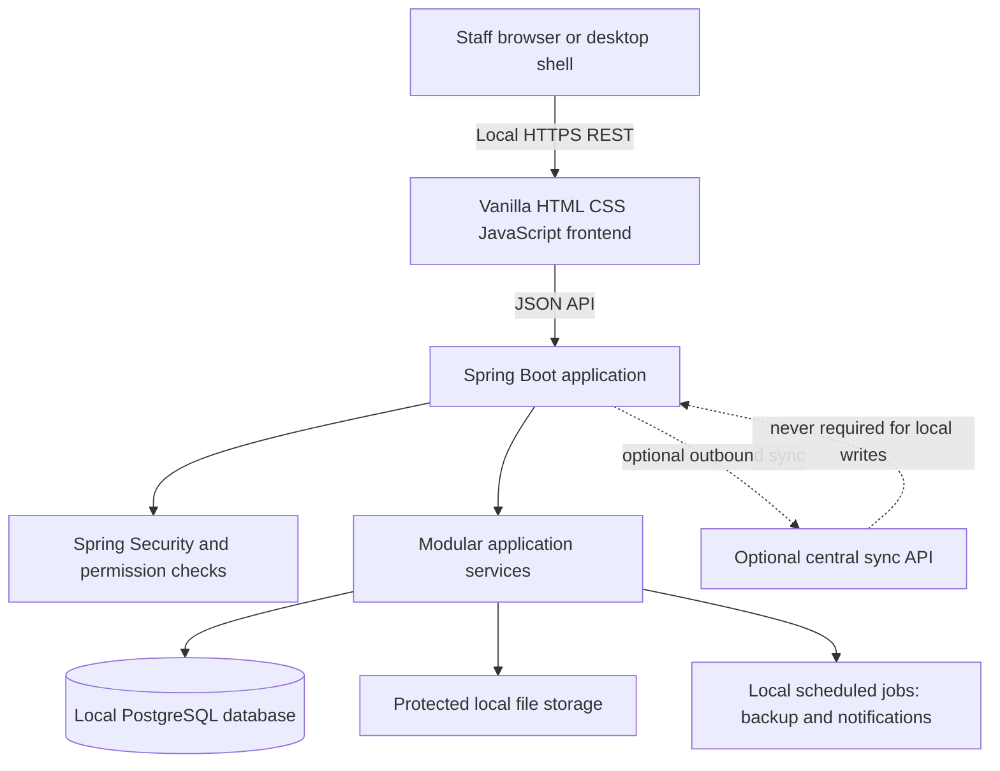
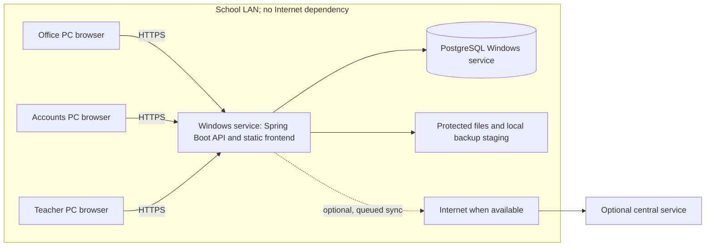
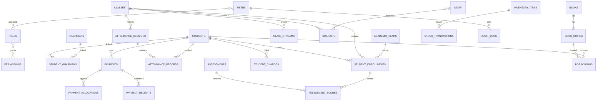

# School Management System: Architecture and Requirements

**Status:** Draft for review; no application code has been started.  
**Decision requested:** Review and approve the scope, permissions, data model, and deployment assumptions in this document before implementation.

## 1. Scope and assumptions

The initial product is a single-school, offline-first system installed on a Windows server computer on the school's LAN. Staff access it from supported desktop browsers, with an optional Windows desktop launcher for the server computer. PostgreSQL and the Spring Boot application run locally; core workflows make no external network calls. A future cloud service is an optional synchronisation destination, not a prerequisite for local operation.

This is a substantial operational system. The roadmap deliberately delivers a secure, useful foundation and then adds modules in increments. “Production-ready” is a release quality bar, not a claim that every requested module can be completed in the first milestone. The school must approve jurisdiction-specific rules such as grading, retention, fee policy, and report-card content.

Initial assumptions to confirm:

- One school per local installation. Multi-school tenancy is not required for the first release.
- The school provides a dedicated, supported Windows computer, reliable power protection, a LAN/router, and a designated backup destination.
- Multiple LAN users share the local database. If the LAN fails, remote computers cannot reach the server; this is a physical network limitation, not something browser code can solve.
- English and GHS are initial defaults. Currency, school identity, academic calendar, grading, and local identifiers are configuration, not constants.
- Student/staff records and financial/audit history are retained through archive or reversal workflows; ordinary users do not hard-delete posted records.
- Expected initial scale and simultaneous-user target must be confirmed before capacity testing. Provisional validation target: 20,000 active and historical students and 50 concurrent LAN sessions on the recommended server hardware.

## 2. System requirements specification

### 2.1 Functional requirements

| Module | Required capabilities |
|---|---|
| School configuration | Configure school identity, logo, contacts, location, school type, academic calendar, currency (default GHS), receipt numbering, colours, grading, report-card presentation, and operational settings. Keep school-specific values out of source code. |
| Authentication and users | Sign in/out, change password, administrator-controlled reset and activation, failed-login controls, session expiry/revocation, login history, user profiles, role assignment, and permission administration. Hash passwords with a supported adaptive password encoder; never store plaintext or log secrets. |
| Roles and permissions | Store roles, permissions, and assignments in the database. Enforce least privilege on every protected API operation. Scope access where required (assigned class/subject, own account, or authorised administrative scope); do not rely on hidden UI controls. |
| Admissions | Register and search applications, issue unique application numbers, capture applicant/guardian/prior-school/programme/class information, track pending/reviewed/approved/rejected/waitlisted/enrolled states, and convert an approved application to a student once without duplicating identity data. |
| Students and guardians | Create, view, update, search, filter, sort, paginate, archive, transfer, and print student profiles. Store identity, demographic, contact, admission, photograph/document references, status, guardians and emergency contacts. Show academic history, attendance, results, fee account, payments, documents, and disciplinary records as those modules become available. Support multiple guardians and controlled data export. |
| Staff | Manage staff identity, contact details, employment, department, position, qualification, status, photo and documents; distinguish teaching, administrative, and support staff. Link staff records to user accounts without requiring every staff member to have a login. |
| Academics | Configure academic years, terms, class levels, streams, subjects, departments, teacher-subject assignments, and student enrolments. Preserve historical enrolments when students transfer, repeat, graduate, or are promoted. Never assume fixed class names. |
| Attendance | Record present/absent/late/excused attendance by date, session, class and student; prevent duplicate student/session records by default; support corrections with authorisation and audit trail. Produce daily, weekly, monthly, term, class, and individual history and percentages. |
| Assessments, examinations and results | Configure assessment types and weighting by academic context; enter and validate scores; calculate grades from configurable grading bands; record remarks; submit, approve, lock, and correct results through controlled workflows. Preserve result versions and audit every change after approval. |
| Report cards and transcripts | Generate print-ready reports with school/student/term/class identity, subject components, totals, grades, remarks, attendance and authorised teacher/head remarks. Support configured layouts. PDF generation must work locally without a cloud service. |
| Promotion | Preview eligible cohorts and perform individual or bulk promotion, repeat, graduation, or transfer. Require confirmation and retain source/destination enrolment and decision history; never overwrite prior class history. |
| Fees and finance | Configure fee items/structures, apply charges, discounts and scholarships, maintain student accounts, record payments/refunds/reversals, calculate balances on the backend, and provide payment history, outstanding balances and account statements. All posting operations are transactional and permission-controlled. |
| Receipts | Generate a unique receipt number atomically with a successful payment. Print/download/reprint existing receipts without creating another payment. Display school, receipt/date, student, description, method, amount, balances and receiving user. |
| Timetable | Configure days, periods, rooms, classes, subjects and teachers. Detect teacher, class and room collisions. Only an explicitly authorised override may save a conflict, and the override reason is recorded. |
| Library | Catalogue books, authors, categories, publishers, ISBNs and physical copies; track borrower, issue/return/renewal, due dates, condition, fines and borrowing history; search and produce overdue reports. |
| Inventory/store | Manage items, categories, suppliers, purchases, stock issues, returns and adjustments. Derive on-hand quantities from recorded stock transactions or a controlled ledger; do not silently overwrite quantity. Record actor, reason and time for each movement. |
| Announcements and notifications | Create, schedule, expire and target announcements to everyone, staff, teachers, students, parents or selected classes. Provide an internal notification abstraction that can later support email/SMS/push without coupling core workflows to a provider. |
| Reports and search | Provide paginated server-side search and central reports for student registers/demographics/admissions/history, academic results/grade distribution/transcripts, attendance, collections/payments/outstanding fees, login history and audit activity. View/print/export to CSV and locally generated PDF where appropriate. Global search is permission-filtered. |
| Audit and login history | Record security and business events including authentication outcomes, student changes/archive, result entry/approval/correction, fee/payment/reversal, user/role/permission changes, settings, backup and restore. Capture actor, action, module, record ID, timestamp, IP/device data where available, and structured before/after values where appropriate. Ordinary users cannot edit or delete logs. |
| Backup and restore | Manual and scheduled backups, destination/configuration, backup history, health and last-success indicators, warning for stale backups, integrity checks, and confirmed restore with a pre-restore backup. Protect backup files using OS permissions and preferably encryption. A backup on the same physical disk alone is not sufficient. |
| Optional synchronisation | Later phase only: durable outbox, retryable change delivery, sync status/history, idempotency, conflict detection and explicit resolution. Do not silently overwrite local or cloud edits. Core local transactions must succeed while the central service is unavailable. |

### 2.2 Cross-cutting quality requirements

- **Availability/offline:** authentication and all installed core modules work without Internet. External services are never on the critical path for local operations.
- **Data integrity:** database constraints back up application validation; financial posting, receipt creation, and other multi-record actions use transactions; approved results and posted finance records use correction/reversal, not silent mutation.
- **Security:** deny-by-default authorisation, password hashing, input validation, parameterised persistence, output encoding, CSRF protection for cookie-authenticated state changes, secure session cookies, authentication throttling, secret/config separation, and security/audit tests.
- **Privacy:** collect only fields the school needs; restrict sensitive records and exports; define retention, consent/notice, backup access and incident procedures with the school and applicable law before production rollout.
- **Performance:** paginated APIs and indexed search; no unbounded browser downloads or N+1 query patterns. Validate the provisional scale target under representative data and hardware.
- **Accessibility/usability:** semantic HTML, keyboard operation, visible focus, labels, accessible error states, responsive desktop/tablet layouts, predictable navigation and confirmation for irreversible actions.
- **Recoverability:** scheduled backup monitoring and a documented restore drill. Provisional operational target: daily backup with RPO no worse than 24 hours and a tested RTO within 4 hours, subject to school approval and backup hardware.
- **Maintainability:** modular Spring packages, versioned Flyway migrations, DTO-based REST contracts, service-layer rules, automated tests, and documented installation/upgrade/backup procedures.

## 3. Roles and permission matrix

Permissions are database-defined and grouped by resource/action. The matrix below is the proposed initial role template, not hard-coded authorization logic. Assignments can be changed by an authorised administrator. All actions remain subject to record scope and workflow state. `V` = view/search; `C` = create/record; `E` = edit; `A` = approve/post/lock; `M` = administer/configure; `-` = no grant. `Own` means own record; `Assigned` means class/subject/work assigned to the user; `School` means the whole school's records.

| Role | Students/admissions | Academics/attendance | Results | Finance | Staff/users/settings | Library/inventory | Reports/audit/backup | Announcements |
|---|---|---|---|---|---|---|---|---|
| SUPER_ADMIN | School V/C/E/M | School V/C/E/M | School V/C/E/A/M | School V/C/E/A/M | Full M | Full M | Full V/M | Full V/C/E/M |
| ADMIN | School V/C/E; admissions A | School V/C/E/M; attendance V | School V; result A when delegated | V; finance M only if explicitly granted | User/role M except super-admin control; settings M | V/C/E/M | Operational V; audit V; backup M | V/C/E/M |
| HEADMASTER | School V; admissions A | School V/M; attendance V | School V/A (approve/lock) | School V (no posting by default) | Staff V; user V | V | School report V; audit V; backup V | V/C/E/M |
| TEACHER | Assigned students V; no admissions | Assigned classes V; attendance V/C/E; assigned academics V | Assigned subjects V/C/E; submit for approval, no approval | - | Own staff profile V/E (limited) | Library V/borrow | Assigned-class reports V | V |
| ACCOUNTANT | Student identity V (minimum necessary) | Class V (reference only) | - | School V/C/E; payment/refund A only if separately granted | - | - | Finance reports V; finance audit V | V |
| SECRETARY | School V/C/E; admissions V/C/E; no final admission approval by default | School V/C/E for calendar/class administration if delegated; attendance V | V (no score edits/approval) | Student account V; no posting by default | Staff V/C/E (administrative fields) | Student/admin reports V; no security audit | V/C/E when delegated |
| DATA_ENTRY_OPERATOR | School V/C/E for assigned intake fields; archive/delete - | V/C/E for explicitly assigned setup | V/C/E only if explicitly assigned; no approval | Student account V; no posting | Staff V/C/E if assigned | V/C/E only if assigned | Limited operational reports V | V |
| LIBRARIAN | Borrower identity V (minimum necessary) | Class V (reference only) | - | - | - | School V/C/E; circulation C/E; fine rules M only if delegated | Library reports V | V |
| STORE_MANAGER | - | - | - | - | - | Inventory V/C/E; stock adjustments M with reason | Inventory reports V | V |
| STUDENT | Own profile V; own applications if enabled | Own enrolment V; timetable V | Own published results V | Own statements/receipts V | Own account V/E limited | Catalogue V; own borrowing V | Own reports only | Audience V |
| PARENT | Linked child profile V (approved fields) | Linked child enrolment/attendance V | Linked child's published results V | Linked child's statements/receipts V | Own account V/E limited | Catalogue V; linked child's borrowing V | Linked child reports only | Audience V |

Initial role templates deliberately omit broad powers where separation of duties matters. Examples: the person recording a payment should not automatically be allowed to reverse it; result entry and result approval should be separated; restore and permission administration are tightly limited. A school can grant explicit additional permissions after review. `SUPER_ADMIN` is a trusted system owner role and should be held by as few accounts as possible.

Permission identifiers are granular (examples): `STUDENT_VIEW`, `STUDENT_CREATE`, `STUDENT_EDIT`, `STUDENT_ARCHIVE`, `ADMISSION_REVIEW`, `ADMISSION_APPROVE`, `ATTENDANCE_RECORD`, `ATTENDANCE_CORRECT`, `RESULT_ENTER`, `RESULT_SUBMIT`, `RESULT_APPROVE`, `RESULT_LOCK`, `RESULT_CORRECT_APPROVED`, `FEE_CHARGE_CREATE`, `PAYMENT_RECORD`, `PAYMENT_REVERSE`, `RECEIPT_REPRINT`, `USER_MANAGE`, `ROLE_MANAGE`, `PERMISSION_ASSIGN`, `AUDIT_VIEW`, `BACKUP_CREATE`, `BACKUP_RESTORE`, `SETTINGS_EDIT`. Permissions are checked in services/API authorization, not just by the frontend.

## 4. System architecture

### 4.1 Logical architecture



The browser is a client, not the authority for business rules. The REST API validates requests, enforces permissions and record scope, and invokes transactional services. Spring Data JPA/Hibernate provides repository access; Flyway owns schema evolution. Controllers accept/return DTOs and do not contain business logic. A global exception handler returns consistent safe errors. File uploads (photos, documents, logos, generated reports) are stored outside the public web root with database metadata and access checks.

### 4.2 Deployment topology



For the first release, deploy one Spring Boot service and one PostgreSQL instance on a designated Windows host. Configure the app to bind only to loopback and the trusted LAN interface, firewall the API/database so PostgreSQL is not exposed to client PCs, and require authenticated application access. LAN traffic should use HTTPS; certificate provisioning/trust is an installation concern to test on school-managed devices. The database account used by the app has only required schema permissions. Secrets are provided through protected OS configuration or a secrets file with restrictive ACLs, never checked into source control.

Modules are organized by domain (`auth`, `users`, `students`, `admissions`, `academics`, `attendance`, `results`, `finance`, `library`, `inventory`, `reports`, `audit`, `backup`, `settings`) with controller, service, repository, DTO/mapper, validation, and domain types at appropriate boundaries. Shared infrastructure contains security, error handling, persistence configuration, and common API types. Avoid a distributed microservice deployment for a single school's local server; modular monolith transactions are simpler and safer for enrolment and finance.

## 5. Database design

### 5.1 Key design rules

- Use UUID primary keys for durable/synchronisable business records; generate IDs locally. Use explicit human-readable numbers (admission, receipt, application, staff) as separate unique business identifiers, never as database primary keys.
- Use PostgreSQL, Flyway migrations, UTC timestamps (`timestamptz`), and `numeric(precision, scale)` for money. Never use floating-point money.
- Enforce uniqueness, nullability, foreign keys, checks and indexes in migrations. Soft archive important people/records; keep posted ledger rows immutable and correct them with reversing/adjustment entries.
- Store files in protected filesystem/object storage and retain metadata, owner, MIME type, size, checksum and access policy in the database. Do not store arbitrary public file paths in client-visible records.
- Record `created_at`, `created_by`, `updated_at`, `updated_by` where appropriate. Use optimistic version columns on records that can be concurrently edited.
- Audit sensitive changes with append-only application permissions and restricted database role access. Log structured, redacted values; do not capture passwords, session tokens, or unnecessary sensitive data.
- Do not add a `school_id` discriminator to every table in the single-school first release without a multi-tenant requirement. Future cloud tenancy requires an explicit isolation and migration design, not just a nullable column.

### 5.2 Entity catalogue

The following is the conceptual initial catalogue. Join/child tables are first-class entities when they carry dates, status, history, or attributes.

| Domain | Entities and key relationships |
|---|---|
| Identity/access | `users` (unique username/email as configured), `roles`, `permissions`, `user_roles` (user-role join), `role_permissions` (role-permission join), `user_sessions` or framework-managed session store, `login_logs`. A user may have many roles; a role many permissions. Staff/student/guardian account links are optional and unique where applicable. |
| School/config | `school_information` (single active configuration), `system_settings` (key/value with typed validation), `file_assets` (protected file metadata), `academic_years`, `terms`. Academic year owns terms; dates must be valid and configured terms must not overlap unless policy explicitly permits it. |
| People/admissions | `students`, `guardians`, `student_guardians` (relationship, primary/emergency flags), `student_documents`, `disciplinary_records`, `admission_applications`, `application_guardians`, `staff`, `departments`, `positions`, `staff_documents`. Approved application conversion stores a unique application-to-student link. Student admission number and staff ID are unique; archived people remain referenceable. |
| Academics | `classes` (configurable grade/level), `class_streams`, `subjects`, `class_subjects`, `teacher_subjects`, `student_enrollments` (student, class/stream, academic year, start/end, status, promotion source), `promotion_records`. Historical enrolment is retained; at most one current active enrolment per student for the applicable school rule. |
| Attendance | `attendance_sessions` (class, date, session identifier, academic term, recorder, status), `attendance_records` (session, student, state, note, correction/version). Unique `(session_id, student_id)` prevents duplicate marking; session uniqueness follows the configured class/date/session policy. |
| Assessment/results | `assessment_types`, `assessments` (subject/class/term, max score, weight, dates, state), `assessment_scores` (assessment, student enrollment, score, entered by), `examinations` if an exam-specific lifecycle is needed, `examination_scores` if distinct from general assessment, `grading_scales`, `grade_bands`, `result_summaries` or reproducible report-card snapshots, `result_approvals`, `result_change_history`. Score must be within configured maximum; grade bands must be non-overlapping and cover the intended scale. |
| Finance | `fee_items`, `fee_structures`, `fee_structure_items`, `student_fee_accounts`, `student_charges`, `discounts`, `scholarships`, `account_adjustments`, `payments`, `payment_allocations`, `payment_methods`, `payment_reversals`, `payment_receipts`. Posted payments and allocations are immutable; receipt number unique; amounts non-negative and currency explicit. Balances are derived from posted charges, adjustments, discounts, scholarships, allocations and reversals, not accepted from the browser. |
| Timetable | `school_days`, `periods`, `classrooms`, `timetable_entries` (class/stream, subject, teacher, room, day, period, effective dates), `timetable_conflict_overrides`. Database uniqueness/exclusion rules should prevent same-resource slot collisions where practical; service validation reports useful conflicts. |
| Library | `book_categories`, `books`, `book_authors`, `authors`, `publishers`, `book_copies`, `borrowings`, `borrowing_renewals`, `library_fines`, `fine_payments` if fines are financially collected. Each copy has a unique barcode and at most one active borrowing. |
| Inventory | `inventory_categories`, `inventory_items`, `suppliers`, `purchases`, `purchase_lines`, `stock_transactions` (receipt/issue/return/adjustment with reason, quantity, actor, reference), optionally `stock_counts`. Current stock is derived or maintained transactionally against the immutable movement ledger. |
| Communication/reporting | `announcements`, `announcement_audiences` (role/class/user target), `notifications`, `notification_deliveries` for future provider adapters, `report_jobs` only if asynchronous generation is needed. |
| Governance/operations | `audit_logs` (append-only), `backups` (metadata/status/checksum/location, not database contents), `sync_outbox`, `sync_inbox`, `sync_conflicts`, `sync_runs` (later synchronisation phase). Login history and business audit remain distinct. |

### 5.3 Primary and foreign key map

Every entity table uses an `id UUID PRIMARY KEY` unless identified as a join table below. Join tables also have UUID primary keys for consistent audit references and enforce the listed natural-key `UNIQUE` constraints. Foreign keys use the referenced table's `id`; optional relationships are nullable. This is the initial logical key map; exact column types and migration ordering are defined when the schema is approved.

| Tables | Foreign keys / key relationships |
|---|---|
| `user_roles`, `role_permissions` | `user_roles.user_id -> users.id`, `role_id -> roles.id`; `role_permissions.role_id -> roles.id`, `permission_id -> permissions.id`; each pair unique. |
| `students`, `guardians`, `staff` | Optional `user_id -> users.id` (unique when present); `staff.department_id -> departments.id`, `position_id -> positions.id`. Keep login identity separate from personal/employment records. |
| `student_guardians`, `student_documents`, `disciplinary_records` | `student_guardians.student_id -> students.id`, `guardian_id -> guardians.id`; documents and discipline records reference `student_id`; `file_asset_id -> file_assets.id` for attached files; actor references point to `users.id`. |
| `admission_applications`, `application_guardians` | Application optionally references the resulting `student_id -> students.id` (unique, nullable); `application_guardians.application_id -> admission_applications.id`. The conversion reference is unique to ensure one-time enrolment. |
| `terms`, `class_streams`, `subjects`, `class_subjects`, `teacher_subjects` | `terms.academic_year_id -> academic_years.id`; `class_streams.class_id -> classes.id`; optional `subjects.department_id -> departments.id`; class-subject rows reference class/subject/year; teacher-subject rows reference staff, subject, class/stream and academic year. |
| `student_enrollments`, `promotion_records` | Enrolments reference student, class, optional stream, academic year, and optional originating admission; promotion records reference student, source enrolment, destination enrolment when created, and authorising user. |
| `attendance_sessions`, `attendance_records` | Sessions reference class/stream, academic year, term, recorder `users.id`; records reference session and student enrolment plus marking/correction actor. Unique `(session_id, student_id)` (or enrolment ID where repeated enrolments in one session are possible). |
| `assessments`, `assessment_scores`, grading/results | Assessments reference class/subject/year/term and assessment type; scores reference assessment, student enrolment and entering user; grade bands reference grading scale; approvals/change history reference result/assessment context and acting user. |
| `fee_structures`, `fee_structure_items`, student accounts/charges | Structure references academic year/class as policy requires; line references structure and fee item; account references student (unique per account/currency policy); charge references account, fee item and originating structure when applicable; discounts/scholarships and adjustments reference the account and authorising user. |
| `payments`, `payment_allocations`, `payment_receipts`, reversals | Payment references student account and configurable payment method; allocation references payment and charge; receipt references payment (unique) and issuing user; reversal references the original payment and reversing/approving users. Use unique idempotency key for payment submission. |
| `timetable_entries`, `timetable_conflict_overrides` | Entry references class/stream, subject, teacher (`staff.id`), room, period and effective academic year; override references entry, authorising user and reason. |
| `books`, `book_copies`, `borrowings`, library fines | Book references category/publisher; `book_authors` references book and author; copy references book; borrowing references copy and borrower (student or staff through separately constrained nullable FKs), checkout/return actors; fines reference borrowing and any linked payment. |
| `inventory_items`, suppliers, purchases and `stock_transactions` | Purchase references supplier; purchase line references purchase and inventory item; stock transaction references item, optional supplier/purchase, optional user and source transaction for a reversal. Quantity changes are recorded, not overwritten. |
| `announcements`, `announcement_audiences`, notifications | Audience rows reference announcement and one configured audience target (role, class, or user); notifications reference recipient user and optional announcement. Enforce exactly one target kind per audience row. |
| `audit_logs`, `login_logs`, `backups`, sync tables | Audit/login rows reference user when known (nullable for failed/unknown login); backup rows reference initiating user; sync event/conflict/run rows reference their local entity/event identifiers and sync run. Audit records do not cascade-delete with users. |

### 5.4 Important constraints and indexes

- Unique: username, permission code, role code, admission number, student number (if separate), staff ID, application number, receipt number, book-copy barcode, and configured subject code within its uniqueness scope.
- Unique joins: `(user_id, role_id)`, `(role_id, permission_id)`, `(student_id, guardian_id)`, `(academic_year_id, term_code)`, `(class_id, subject_id, academic_year_id)` as policy requires, and `(attendance_session_id, student_id)`.
- Checks: score between zero and assessment maximum; percentage/weight in valid range; dates ordered; positive or non-negative money/quantity according to transaction type; supported enum/status values; exactly one primary guardian where school policy requires it; end date after start date.
- Foreign keys use deliberate delete behavior. Historical references generally `RESTRICT`; optional dependent metadata may cascade only where data loss is safe and explicitly intended. Archive business records rather than cascading deletion.
- Index frequent filters: student normalized name/admission number/status, enrolment class/year/status, attendance session date/class, assessment subject/term, payment student/date/receipt, borrowing due date/status, inventory transaction item/date, audit actor/time/module/record, and login user/time/outcome.
- Financial actions run in a database transaction, lock or version the affected account as needed, enforce idempotency for retried requests, and atomically create payment, allocations, receipt and audit event.

### 5.5 ERD overview



The diagram is intentionally a navigable overview, not a full physical schema. Before database implementation, approve specific uniqueness scopes, attendance session policy, grading/weighting model, fee posting/reversal rules, and whether parent/student portals are in the first release.

## 6. API architecture

Use versioned JSON REST APIs under `/api/v1`. List endpoints support bounded pagination (`page`, `size` with a server maximum), allowlisted sort fields, filters and server-side search. Use DTOs, validation, consistent timestamps, and stable error responses. Mutations require authorization and CSRF protection where cookie sessions are used. Return `409 Conflict` for duplicate/state/version conflicts, `422` or `400` for invalid input (choose one consistent policy), `401` for unauthenticated, and `403` for forbidden. Include request/correlation IDs in logs and errors, not stack traces or sensitive SQL.

| Area | Major endpoints (illustrative) |
|---|---|
| Authentication | `POST /auth/login`, `POST /auth/logout`, `GET /auth/me`, `POST /auth/change-password`, `POST /auth/password-reset` (local administrator-mediated reset initially), `GET /auth/sessions` / revoke where supported. |
| Users/access | `GET/POST /users`, `GET/PATCH /users/{id}`, `POST /users/{id}/activate`, `POST /users/{id}/deactivate`, `GET/POST /roles`, `PATCH /roles/{id}`, `GET /permissions`, `PUT /roles/{id}/permissions`, `PUT /users/{id}/roles`. |
| Students/guardians | `GET/POST /students`, `GET/PATCH /students/{id}`, `POST /students/{id}/archive`, `POST /students/{id}/transfer`, `GET /students/{id}/profile`, `GET/POST /students/{id}/guardians`, document upload/download endpoints with authorization. |
| Admissions | `GET/POST /admissions/applications`, `GET/PATCH /admissions/applications/{id}`, `POST /admissions/applications/{id}/review`, `/approve`, `/reject`, `/waitlist`, `/enrol`. |
| Staff | `GET/POST /staff`, `GET/PATCH /staff/{id}`, archive and protected document endpoints. |
| Academics | CRUD/list endpoints for `/academic-years`, `/terms`, `/classes`, `/classes/{id}/streams`, `/subjects`, `/class-subjects`, `/teacher-assignments`, `/enrollments`; promotion preview and `POST /promotions` endpoints. |
| Attendance | `GET/POST /attendance/sessions`, `GET /attendance/sessions/{id}`, `PUT /attendance/sessions/{id}/records`, correction endpoint with reason, and reports under `/attendance/reports`. |
| Assessments/results | CRUD `/assessments`, score batch import/entry `/assessments/{id}/scores`, result calculation/preview, `POST /results/{id}/submit`, `/approve`, `/lock`, controlled correction request/decision, and `/grading-scales`. |
| Reports | `GET /reports/students`, `/admissions`, `/attendance`, `/results`, `/finance/collections`, `/finance/outstanding`, `/audit`, `/login-history`; export endpoints return authorized CSV/PDF content with safe filenames. |
| Finance | CRUD/config `/fee-items`, `/fee-structures`, `/payment-methods`; `POST /students/{id}/charges`; `GET /students/{id}/account`; `POST /payments`; `GET /payments/{id}`; `POST /payments/{id}/reverse` with reason/approval; `GET /receipts/{id}` and print/download existing receipt. |
| Timetable/library/inventory | CRUD and search endpoints for `/timetables`, `/books`, `/book-copies`, `/borrowings` with checkout/return/renew operations, `/inventory/items`, `/suppliers`, `/purchases`, `/stock-transactions`; transactional commands expose explicit actions rather than arbitrary balance edits. |
| Announcements/settings | `/announcements`, `/notifications`, `/school-information`, `/settings`; role-gated updates and audience-filtered reads. |
| Audit/backup | Read-only `/audit-logs` and `/login-history` for authorised auditors; `POST /backups`, `GET /backups`, `POST /backups/{id}/restore` restricted to system administrators with confirmation, integrity validation and a pre-restore backup. |
| Synchronisation (later) | `GET /sync/status`, `GET /sync/runs`, conflict listing/resolution endpoints and authenticated outbound/inbound protocol. The API must be idempotent and version-aware; do not expose a generic database replication endpoint. |

Standard error shape: `{ "success": false, "code": "DUPLICATE_ADMISSION_NUMBER", "message": "An application already uses this admission number.", "timestamp": "...", "path": "/api/v1/students", "requestId": "..." }`. Messages must not disclose whether protected accounts exist where that creates a security risk.

## 7. Frontend architecture

Use separate HTML entry pages and feature modules; no frontend framework. Suggested structure:

```text
frontend/
  index.html
  login.html
  dashboard.html
  pages/
    students.html
    student-profile.html
    admissions.html
    staff.html
    academics.html
    attendance.html
    results.html
    finance.html
    timetable.html
    library.html
    inventory.html
    reports.html
    settings.html
  css/
    tokens.css
    base.css
    layout.css
    components.css
    pages/
  js/
    api/ client.js errors.js
    auth/ session.js permissions.js
    common/ forms.js tables.js pagination.js dialogs.js notifications.js format.js
    students/ admissions/ staff/ academics/ attendance/ results/ finance/
    timetable/ library/ inventory/ reports/ settings/
  assets/
```

The shared API client owns request headers, CSRF token handling, error parsing, and session-expiry behavior. Feature modules own page behavior and call APIs; they do not duplicate authorization decisions. The UI hides unavailable actions for clarity but the backend remains authoritative. Use server-side pagination/filtering, accessible forms, loading/empty/error/success states, confirmation before archive/reversal/restore, and print-specific styles. Avoid storing sensitive records or credentials in `localStorage`; browser caching is not a substitute for the local database. Initial v1 should not advertise browser offline editing on disconnected client devices unless an explicit encrypted, conflict-aware local queue is designed and tested.

## 8. Windows desktop and LAN deployment

Recommended initial packaging is a managed local-server installer plus a lightweight optional desktop launcher:

1. Install a supported Java runtime, Spring Boot service, PostgreSQL service, schema migrations, protected configuration and required Windows firewall rules. Run services under restricted service accounts and configure automatic startup/recovery.
2. The Spring Boot process serves the compiled/static vanilla frontend and API from one origin, simplifying CORS and session security. It performs a health check before the launcher opens the local URL.
3. Other LAN devices use a browser URL to the server's DNS name/IP over HTTPS. They do not run their own database or backend.
4. A small Electron shell is the provisional desktop choice because it packages a familiar Windows window and icon while keeping the web application unchanged. It should connect to the installed local service, not own the database. Service lifecycle belongs to the installer/service manager, not a renderer process. Tauri is a viable smaller alternative but should be selected only after validating Windows WebView/runtime and Java-service integration requirements. A browser-first PWA may be simpler for deployment and remains an option if a native shell adds no needed capability.
5. Installer/upgrade design must preserve data, apply Flyway migrations before serving traffic, provide rollback/recovery procedure, and never replace the production database or backups silently. Updates are signed and staged; update delivery is optional and cannot be required for core operation.

An installed desktop shell does not make a shared LAN application available when the host/server is powered off. A workstation cannot safely open the central PostgreSQL database directly. Hardware failure recovery requires restoring the service and database from a verified backup, ideally onto a replacement host.

## 9. Offline and synchronisation behavior

| Network condition | Expected behavior |
|---|---|
| Internet available | The local application remains authoritative for school workflows and works normally. Optional sync runs asynchronously, with durable queued changes, idempotent delivery, status visibility and conflict review. A cloud outage must not block local sign-in or writes. No core module depends on hosted fonts, CDNs, analytics or external APIs. |
| Internet unavailable | No change to local login, records, attendance, results, finance, receipts, reports, library, inventory, backup or restore, provided the local server and LAN are healthy. Cloud-dependent optional actions are queued or shown unavailable without blocking local workflows. |
| School LAN available | Client PCs reach the central Windows host over the LAN; all read/write traffic goes through the Spring Boot API and local PostgreSQL. Internet is unnecessary. |
| School LAN unavailable | The server computer itself can continue to operate locally (loopback/desktop shell) if it is running and healthy. Other PCs cannot access the application until the LAN is restored. V1 does not promise multi-master operation or independent writes from every disconnected workstation. |
| Central online server unavailable | Local operation continues. The local outbox retains pending changes and retries with backoff when connectivity returns. Conflicts are surfaced for an authorised human or deterministic, approved policy; last-write-wins is not acceptable for student identity, results, fees or stock. |

If future requirements demand offline use from individual disconnected PCs, that is a separate capability: an encrypted local store, user/device identity, queued commands, conflict handling, revocation/expiry behavior and data-loss/security analysis must be specified. It is not equivalent to LAN-first operation and is not included in initial delivery.

### 9.1 Optional sync safeguards

Each syncable record has stable UUID, origin installation ID, version, updated timestamp and deletion/archive marker. A transactional outbox is written alongside local changes; retries use idempotency keys. The receiving side records processed event IDs. Conflicts compare known base versions and changed fields and create an explicit conflict record rather than overwrite. Finance records are append-only events with reversals; approved academic results require a correction workflow. School IDs and data ownership are provisioned before any central service is enabled. Sync starts only after security, privacy, retention, conflict-resolution and backup policies are approved.

## 10. Security and operational decisions

- Prefer Spring Security server-side sessions for the same-origin local web application, with `HttpOnly`, `Secure` (under HTTPS), and appropriate `SameSite` cookies, CSRF tokens for state-changing requests, idle/absolute expiry, and session revocation. Re-evaluate if a separately hosted cloud/mobile client is later approved.
- Use a strong adaptive password hash supported by Spring Security (Argon2id or bcrypt with calibrated work factor); reset tokens, if introduced, are random, short-lived, single-use and hashed at rest. Apply progressive login throttling and generic failure messages.
- Validate all input at API boundaries and in domain services; use JPA parameter binding; encode output; restrict upload type/size; protect downloads; prevent path traversal; do not trust client-supplied totals, roles, IDs or permission flags.
- Require HTTPS for LAN access, restrict ports through Windows Firewall, avoid exposing PostgreSQL to the LAN, protect service credentials and backup directories with ACLs, and document certificate renewal. Do not claim transport protection for plain HTTP.
- Log security events without secrets. Audit records should be append-only at application level; for tamper resistance, restrict database/file administrator access and consider signed/exported audit snapshots in a later hardening phase.
- Define restore as a privileged maintenance operation: verify backup checksum/schema compatibility, stop writes, create a pre-restore snapshot, require explicit confirmation, restore, run health checks, then record outcome. Test disaster recovery on a non-production copy.

## 11. Development roadmap

Architecture approval is a gate; the following is a proposed sequence, not a claim of delivered functionality.

| Milestone | Scope and exit evidence |
|---|---|
| 0. Architecture approval | Confirm users/roles, scope, data/privacy policy, grading, fee rules, deployment hardware, backup target, recovery objectives, local-only requirements, and whether parent/student portals are in release 1. Approve ERD/API conventions. |
| 1. Project foundation, PostgreSQL, Spring Boot, Flyway, authentication and access model | Maven modular monolith, configuration without committed secrets, initial migrations for identity/roles/permissions/audit, secure login/session/logout, seedable role/permission templates, global errors, health checks, tests for authentication/authorization and migrations. |
| 2. Frontend foundation and school configuration | Vanilla page shell, responsive navigation, API client, form/table/dialog patterns, login, dashboard baseline, school settings and accessible states. |
| 3. Admissions, students, guardians and staff | Search/pagination, create/edit/archive, documents with access controls, admission review/conversion, staff records, data validation and workflow tests. |
| 4. Academic setup and enrolment | Years, terms, classes, streams, subjects, teacher assignments, student enrolment history, transfer/promotion preview and history. |
| 5. Attendance | Session setup, bulk marking/correction, duplicate prevention, class/student reports and permission tests. |
| 6. Assessment, results and report cards | Configurable assessment weights and grading, score entry, submission/approval/locking/correction history, locally generated printable reports. |
| 7. Fees, payments and receipts | Fee setup, charges, discounts/scholarships, account ledger, transactional payment and receipt, reversals/refunds, statements and reconciliation tests. Do not launch collections without finance approval and transaction/security testing. |
| 8. Timetable, library and inventory | Scheduling with conflict detection; catalogue/circulation/fines; stock movement ledger, purchasing, returns and low-stock reports. |
| 9. Reporting, announcements and audit completeness | Permission-filtered exports, report catalogue, announcement audiences, audit/login review screens, retention controls. |
| 10. Backup, restore and hardening | Scheduled/manual protected backups, backup status/alerts, restore workflow, tested recovery, security review, performance/load and accessibility checks. |
| 11. LAN/Windows packaging and pilot | Windows service installer, optional Electron shell decision/packaging, HTTPS/certificate setup, firewall, upgrade path, pilot on representative LAN and documented support procedures. |
| 12. Optional central sync | Threat/privacy review, installation identity, outbox/inbox, retry/idempotency, conflict UI/workflow, offline tests and sync observability. Separate release gate; never delay local system availability. |
| 13. Production acceptance | User acceptance, data import/migration rehearsal, restore drill, security and regression suites, training, operational sign-off, versioned release and rollback plan. |

At each implementation milestone, provide the changed files, migrations, design explanation, run/test instructions, security considerations, completed scope and remaining work. No feature is called complete until its acceptance checks pass.

## 12. Review questions and acceptance gates

1. Confirm the initial deployment is one school per Windows host and whether the 20,000-student/50-concurrent-user provisional target is reasonable.
2. Confirm which roles need login accounts at launch, whether students/parents have portal access in release 1, and who is allowed to approve admissions, results, payment reversals, role changes and restores.
3. Approve retention, privacy, document handling, audit visibility, backup destination/encryption and recovery objectives with the school's governing requirements.
4. Provide the school's actual assessment weighting, grading bands, attendance session rules, promotion rules, payment/receipt rules, and currency/locale needs before the relevant module is implemented.
5. Choose the supported Windows versions, server hardware, LAN certificate approach, backup media, and whether a desktop shell is required in the first pilot or a browser shortcut is sufficient.
6. Decide if optional cloud sync is an actual release requirement. If yes, specify the central system's ownership, data residency, conflict authority and support model before designing its final protocol.

**No application implementation is included in this document.** Following review and approval, begin Milestone 1 only.
